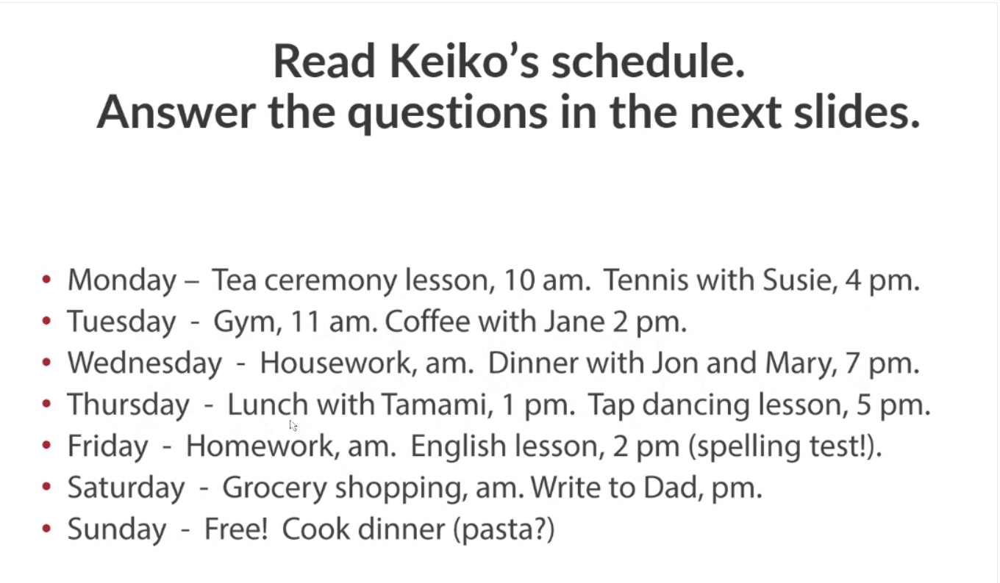

# 10/2/2026 - Online Class Notes

## Spontaneous plan

Before to moment of speaking, or we have evidence
I’m going to call Grandma after dinner
Will - It’s not plan
I will
I won’t … It’s a promise
It will rain — No evidence

## Pre-decided plan

Going to — when you have evidence
It’s going to rain

## Arrangement

PRESENT CONTONIOUS
I’m working tomorrow (time expression)

