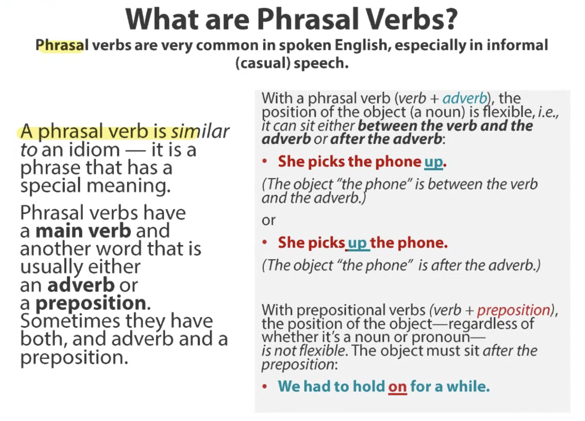

# 16/3/2026 - Online Class Notes  

She had to go on a trip

**Adverb** is describing the action of the verb

**Preposition** on, in, at, for, to, which

cut back on - reduce on something
going up
gone down
bail out
pay off
splash out
inject into
dip into

Rip off
Going on
Pick up
Cut on
Move into — moving o changing
Get by — survive
Pay back
Reach into
Pay back

