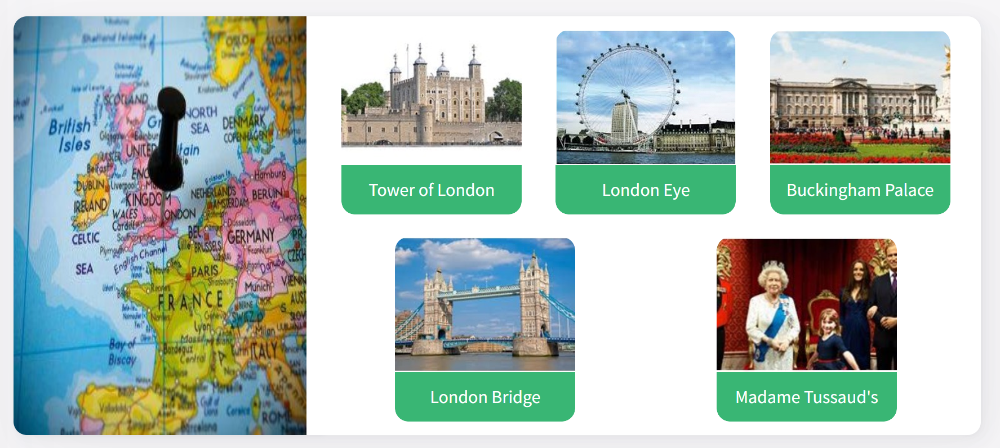

# 2.3.1 Talking about future plans and intentions

## Key words of the lesson

| Future tenses - Uses | Examples                              | Traveling: vocabulary |
| -------------------- | ------------------------------------- | --------------------- |
| plans                | I am traveling soon.                  | sightseeing           |
| intentions           | I am going to visit the local museum. | trip                  |
| dates                | I am going out for dinner tonight.    | journey               |
| decisions            | I am starting a new course next year. | itinerary             |

## Talking about future intentions and decisions

When discussing plans for the future, we have **two options:**

* *Talking about future intentions and decisions.*
* *Talking about future dates and plans.  *
  
Study the following examples...

## Talking about intentions and decisions

* **I'm going to go** out with my friend for dinner. *(Intention / He hasn't called her yet.)*
* **I'm going to go** on holiday to the Caribbean. *(Intention / He / She hasn't made reservations yet.)*
* **I'm going** to study psychology. *(Decision / She hasn't applied for college yet.)*

## Talking about dates and plans

* **I'm going out** for dinner with my friend this evening. *(Definite plan / She has a date.)*
* **I'm going on** vacation to the Caribbean next June! *(Definite plan / He booked the tickets.)*
* I was accepted to college! **I'm starting** my psychology studies next year! *(Definite plan.)*

## Louise's itinerary

It is one week before the board meeting. Read Louise's itinerary, and pay attention to the information included.

|       | Tuesday 21                       |
| ----- | -------------------------------- |
| 09:00 | Go to the Hilton hotel downtown. |
| 11:00 | Register for the lunch meeting.  |
| 12:30 | Attend lunch meeting.            |
| 15:30 | Go home.                         |

|       | Wednesday 22                                                         |
| ----- | -------------------------------------------------------------------- |
| 11:00 | Go to the Hilton hotel downtown.                                     |
| 11:20 | Register for the presentation.                                       |
| 12:00 | Attend the presentation.                                             |
| 13:30 | Present slides with information on the objectives of our department. |

## Talking about future decisions and intentions – Structure

We use **be going to** *+ bare infinitive* when we want to talk about:

* Something we intend to do.
* Something we have already decided to do.

I'm having problems with my clothes because they don't fit anymore. **I'm going to** *start* training at the gym.

I'm really tired. **I'm not going to** *go* to the cinema.

**Are** you **going to** *attend* the congress as you did last year?

## Talking about future dates and plans – Structure

We use **present continuous** + *future time marker* when we want to talk about:  
  
* Appointments or dates.
* Things we have planned to do in the future.

**I'm seeing** Tim Jackson *on Friday 16.* We're having a meeting for the new design.

I'm on a training course abroad. **I'm not going** back to the office *until Saturday.*

**Are** you **doing** anything *on Monday afternoon?*

## Answering Jack's emails while he's away (1/2)

**You're Jack's PA. Read the following email your boss has received.**

July 9, 2019 – 10:30 a.m.

Jack,

I'm writing to ask you about our next meeting. Are you available this week? I discussed your proposal with my manager and he wants to have a new meeting to discuss some ideas from our Marketing Department.

Please, let me know as soon as possible so I can set a date.

Regards,  
Cathy Tims.

## Answering Jack's emails while he's away (2/2)

**You have to answer the following email informing her that he's not in the office. Use the phrases given. There are three extra phrases you will not need.**

Dear Cathy,

I'm Tom, Jack's assistant. I'm sorry, but Jack's not available. He's at a training course in London.

I'll let him know you sent an email.

Regards,
Tom Charles

- Jack is not here.
- He is going to be on a training course in London.
- I'll tell him when he returns.

## Sightseeing

Jack is planning to go sightseeing while he's visiting London. Look at the following popular sights in London and match them with the corresponding picture.

## Describing Jack's trip

**Listen to the conversation again and complete the sentences with the corresponding option.**

* I still need to confirm whether the training **is going to be** extended one more day or not.
* I **am going to visit** the London Eye, of course, but I don't know when.
* I am **not going** to go there. I hate wax museums.
* The taxi **is taking** me to the airport at 7:00 a.m. I need to have time to do the check-in.
* When **is** the flight **leaving**?

## Describing Jack's trip - Comprehension

**Read the following sentences about Joel's trip and say if they are True (T), False (F) or Not Mentioned (N)**

Jack knows how long his trip is going to be. - F
Jack is thinking about going to different tourist places in London. - T
Jack and Tom don't like wax museums. - T
Tom is going to be in charge of Jack's reports. - N
Jack is going to the office on Tuesday morning. - F

## Describing Louise's itinerary (1/2)

**Read Louise's itinerary and complete the sentences with the correct form of the verb.**

On Tuesday, the 21st, I'm going to the Hilton Hotel downtown at 9 a.m. Then, at **eleven**, I'm registering for the **lunch meeting**. An hour and a half later, **I'm attending** the lunch **meeting**. At **half past three**, **I'm going** home.

## Describing Louise's itinerary (2/2)

**Read Louise's itinerary and complete the sentences with the correct form of the verb.**

On Wednesday, the 22nd, I **am going** to the Hilton hotel downtown at **eleven**. **Twenty** minutes later, **I'm** registering for the presentation. **At** twelve, I'm **attending the presentation**. And, at **half past one**, I'm presenting the **slides** *with* information on our **department's** objectives.

