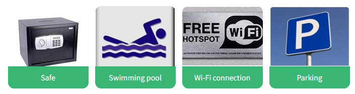
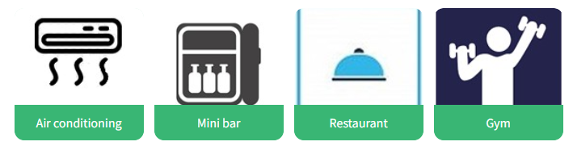
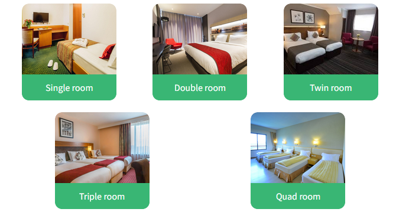
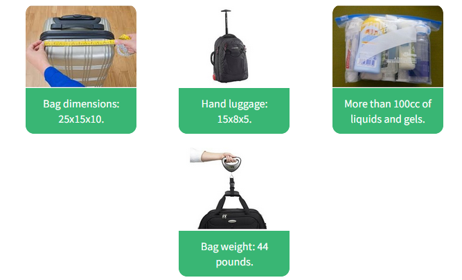
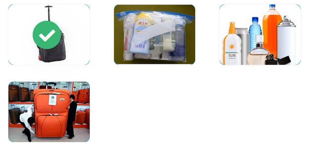
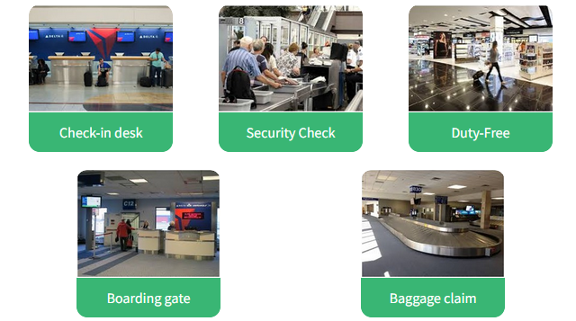

# 2.3.2 Choosing the best accommodation and transport

## Key words of the lesson

| Comparative & Superlative Adjectives            | Lodging                       | Travel                     |
| ----------------------------------------------- | ----------------------------- | -------------------------- |
| cheap - cheaper - cheapest                      | facilities                    | to book a flight           |
| expensive - more expensive - the most expensive | amenities                     | to check-in at the airport |
| as expensive as                                 | services                      | itinerary                  |
| the most / least expensive                      | single / double / triple room | budget                     |
| Irregular comparatives & superlatives           | wake up call                  | packing regulations        |

## Hotel vocabulary

Look at the following hotel signs and match them with the corresponding word.

## Comparing and contrasting people and things

When we want to make comparisons, we can do it in two different ways:  
  
* Using Comparative adjectives
* Using Superlative adjectives.

### Using comparative adjectives

We use comparative adjectives to make comparisons between two nouns.

* Chris Hemsworth is **older** than Liam Hemsworth.
* I'm **taller** than my father.
* Dr. Evangelos Katsioulis (IQ 198) is **more intelligent** than Philip Emeagwali (IQ 190).
* The Boeing 747 is **bigger** than the Boeing 737.
* I think that travelling by airplane is **better** than by bus. It's **more comfortable** and **faster.**

### Structure – Irregular Adjectives

* ***Good** I think Android smartphones are **better** than iPhones.
* **Bad** People feel **worse** during rainy days than on sunny days.
* **Far** *(Physical distance)* London is **farther** from America than from France.
* **Far** *(Figurative distance/quantity)* Before she goes **further**, she'll need more training.

### Using superlative adjectives

Superlative adjectives are used to compare three or more nouns and show which is the best or the worst.

* Terrence Tao is **the most intelligent** person alive. He has an IQ of 230.
* Sultan Kosen is **the tallest** man in the world.
* The Airbus A380 is **the biggest** airplane.  
### Structure - Irregular Adjectives

* **Good** = I think Ferraris are **the best** cars.
* **Bad** = For me, summer is **the worst** season.
* **Far** *(Physical distance)* = What's **the farthest** you've ever run?
* **Far** *(Figurative distance/quantity)* = That's **the furthest** I've gotten in this game.

## Choosing the best accommodation

### Option  1

Read the following descriptions of two hotels. Pay attention to the information provided. Then, you will have to compare the two options.

**The Bridge Hotel** – *3 Stars*
* **Guests:** One adult. Single-bed. Suite - $168  
* **Facilities/Services:** Free Wi-Fi, free parking, breakfast buffet, air conditioning, non-smoking hotel, restaurant, and room service.  
* **Location:** Greenford, Ealing. *Forty minutes from London's city center.*

### Option 2

**Park Grand London** – *4 Stars*
* **Guests:** One adult. Single-bed. Suite - $250
* **Facilities/Services:** Free Wi-Fi, free parking, breakfast buffet, air conditioning, non-smoking hotel, gym, mini bar, restaurant, and room service.
* **Location:** South Kensington. *Twenty minutes from London's city center.*

### Comparing options

Complete the following sentences contrasting the two hotels using the information from the previous activities. Remember that Jack is attending a training in London and he wants to visit some interesting places during his stay.

* The **Bridge Hotel** is cheaper than the **Park Grand.**
* The **Park Grand** has a higher star ranking than the **Bridge Hotel.**
* The **Park Grand** has the highest number of facilities.
* The **Park Grand** is nearer to London than the **Bridge Hotel.**
* The **Park Grand** Is the best option for Jack's trip because it is nearer to the points of interest.

### Room types

Look at the following pictures and match them with the corresponding room type.

### Booking a hotel room

Listen to the following conversation between Jack and the receptionist booking a room for a business trip and match questions and answers.

* What is the receptionist's name? Her name is Aurora.
* Are there rooms available for the date Jack asked? Yes, there are.
* Which type of room does Jack want? Smoking or non-smoking? Non-smoking.
* What is the size of the bed? It's a queen-size bed.
* When is Jack going to receive the confirmation email? In one hour.

###  Key phrases

Listen to the conversation again and complete the sentences given.

* Jack wants to book… a single room.
* The receptionist asks… for his full name.
* It is possible that Jack is going… to need an extra night.
* If he has to stay an extra day, … Jack needs to let the hotel know the night before.

## Checking-in at a hotel

Jack is checking-in at the hotel. Listen to the conversation and put the script in order.  

- Good evening. My name is Jack Richardson, I have a reservation.
- May I see your confirmation code, please, sir?
- Here it is. It's 19472.
- Thanks. Do you have a credit card, sir?
- Of course. Is VISA ok?
- Yes. Thanks. Room 107 is a spacious, non-smoking room, with a queen bed. Does that sound ok to you, sir?
- Yes, that's exactly what I was offered.
- That's wonderful, sir. Now, here's your key.
- Oh, one question. What time is breakfast?
- From 7 a.m. to 10 a.m., sir. We serve breakfast at the restaurant.
- Great. And could you recommend a touristic attraction near-by?
- Well, you can visit the Kensington Palace, sir. It is four blocks away.

### Check-In Forms

Listen to the conversation again and complete the hotel form.

**Grand Park London**
*Check-in form*
* Name: Jack Richardson.
* Confirmation code: 19472.
* Credit card: VISA.
* From: Wednesday, the 8th To: Friday, the 11th.
* Room number: 107.
* Type of room: non-smoking room, with a queen bed.
* Breakfast included: yes.

## Choosing your flight

### Preferences

Read Jack's preferences, budget, and itinerary for his business trip to London. Then, you will read two flight options and choose the best one.

**Itinerary:**
- Free from 7 a.m.  
- Latest time for check-in 11 p.m.

**Budget:**
- $10,000 for plane ticket.  
  
**Preferences:**
- Punctuality is important.  
- Comfort is necessary.  
- Window seat, please!  
- No more than one stop.

### Option 1

Look at the different flight options for Jack's business trip and pay attention to the preferences, budget, and itinerary.

**Tuesday, 8 Mar - 12:30**
- 3 Aisle seats left.
- Business Class: $7,117
- Estimated time: 13h 20m | 1 stop
  
**Comments:**
- *"Flights are usually delayed."*
- *"Flight attendants are not polite."*
- *"It was very comfortable."*

### Option 2

Look at the different flight options for Jack's business trip and pay attention to the preferences, budget, and itinerary.

**Tuesday, 8 Mar – 10:45**
* 10 aisle seats – 5 window seats left.
* Business Class: $8,334
* Estimated time: 14h 30m | 1 stop
  
**Comments:**
* "Excellent service."
* "Punctual flights."
* "Champagne wasn't cold."

### Best option

Look at the different flight options for Jack's business trip and look at his itinerary, budget, and preferences. Choose the best option.

OPTION 2

### Comparing flight options

Complete the following sentences with the appropriate form of the adjective.

* Option 1 is cheaper than option 2.
* The flight in option 2 is earlier than in option 1.
* There are better seats in option 2 than in option 1.
* Option 1 has worse reviews than option 2.
* Option 2 is the best option.

## Packing

Look at the things Jack is preparing to take with him on his trip. Match the pictures and the descriptions.

### Packing - Regulations

Pay attention to the following TSA's regulations. Then, pay attention to Jack's preparations.

### Bags – Weight and size  
  
**Bags**
- United Airlines - 22 x 14 x 9 – 40 lbs.  
  
**Hand Luggage**
- United Airlines - 17 x 10 x 9. (Personal items)  
- United Airlines - 22 x 14 x 9. (Hand luggage)  
  
**Liquids and gels**
- 3 ounces (100cc) or smaller containers of liquid or gel.
- 1 quart size, clear plastic, zip-top bag holding 3 ounces (100cc) or smaller containers.
- 1 bag per traveller placed in the security bin.

### Packing - Which is correct?

Look at the items from the previous activity and compare them with the regulations. Which one is ok?

### Packing - What was wrong?

Complete the sentences explaining why the items he has prepared are wrong. Choose the appropriate comparative adjective.

* The size of the bag is not ok because it is **bigger** than the size limit allowed.
* The hand luggage is **smaller** than the size limit allowed.
* The quantity of liquids and gels is **larger** than the limit allowed.
* The bag is **heavier** than the weight limit allowed. He has to pay an additional fee.

## Where in the airport?

Look at the following pictures of the different places in an airport and match them to the words below.

### Where in the airport? - Function

Match the places in the airport with the activities you do there.

* **Check-in desk is where...** you are accepted by the airline before traveling and you are given a boarding pass.
* **Security check is where...** you go through a scanner and hand in your carry-on bag to be scanned using x-rays.
* **Duty-free is where...** you can buy luxury items like perfume and chocolate without paying taxes for them.
* **Boarding gate is where...** you show your boarding pass and ID to board the plane.
* **Baggage claim is where...** you claim your checked-in baggage after you arrive to destination.
