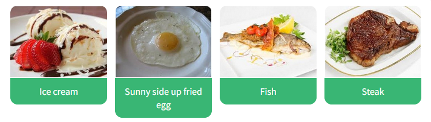
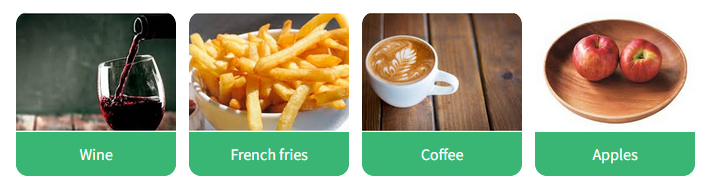
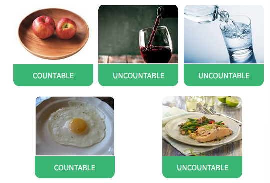
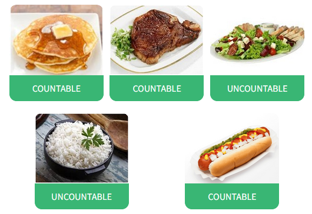
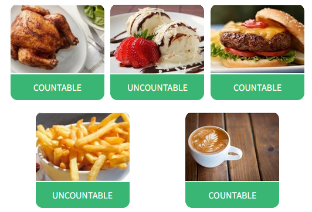
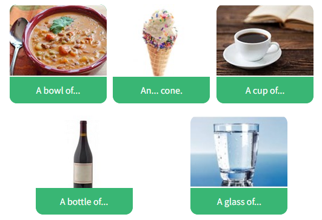
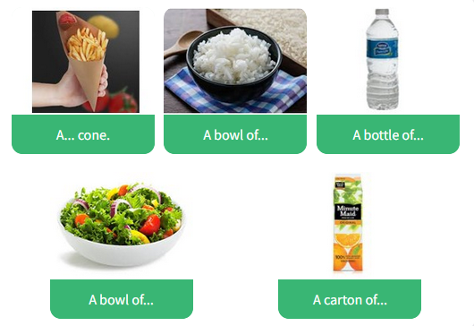
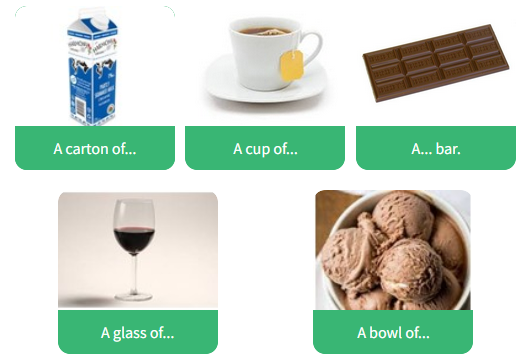

# 2.3.3 Talking about food and quantities

## Key words of the lesson

| Food        | Drinks | Countable/Uncountable |
| ----------- | ------ | --------------------- |
| starter     | water  | How much?             |
| main course | soda   | How many?             |
| dessert     | beer   | some                  |
| chicken     | wine   | any                   |
| meat        | coffee | a piece of            |
| fish        | tea    | a bottle of           |

## Food and drinks vocabulary (1/2)

Match the following food pictures and their corresponding names.

## Food and drinks vocabulary (2/2)

Match the following food pictures and their corresponding names.

## Talking about quantities and measurements

In English, nouns are divided into two groups.

- Countable 
- Uncountable

## Countable nouns

The general concept is that they are nouns which refer to something that **can be counted.**

- There are **eight chairs** in the meeting room.
- I bought **a** new **laptop**.
- Please, make **twelve copies** of the report.

## Uncountable nouns

The general concept is that they are nouns which make reference to things you cannot count.
There are different reasons for this:  
  
- Because it is nearly impossible to count.  
- Because you need to divide it into parts/slices.  
- Because it's a general concept.

## Nouns which are nearly impossible to count

- Can I have **some rice**, please?
- There's **a lot of sand** on the beach.
- How **much water** is there in a glass?

## Nouns which you need to divide into parts/slices

- I only want **a slice of bread.**
- Can I have **a piece of cheese?**
- I'll have **a slice of pizza.**

## Nouns which represent general concepts

Did you check our office **equipment**?
How much (**money**) is this t-shirt?
We have modern **furniture** at home.

## Countable or Uncountable? (1/3)

Divide the following food items into countable and uncountable.

## Countable or Uncountable? (2/3)

Divide the following food items into countable and uncountable.

## Countable or Uncountable? (3/3)

Divide the following food items into countable and uncountable.

## How to count uncountable nouns? (1/3)

In order to count uncountable nouns, we always need a **unit**:

- There are **three pounds** of sand.

**Reminder!** In American English, they do not use the metric system. They measure weight with pounds (Lbs), length in: inches (in / ") or miles (mi); and temperature in Fahrenheit (0°C = 32°F).

## How to count uncountable nouns? (2/3)

- We can use other units, like:  
- I'll have **a bowl of** rice for lunch.
- I'll have a small ice cream **cone**.
- How much is **the carton of** milk?
- Can I have **a glass of** water?

**Remember!** As a general rule, all liquids are uncountable.

## How to count uncountable nouns? (3/3)

**Money is uncountable, because we need to add a currency** (dollar, euro, pound, etc.) **to make it countable.**

- This coat is three **pounds** fifty.
- I only have **fifteen dollars.**
- 
Notice that the concept of **money** is uncountable. On the contrary, most currencies are countable: pesos, dollars, rivas, bitcoins, etc.

## Units for Uncountable Nouns (1/3)

What is the unit for each of the following food products? Match them.

## Units for Uncountable Nouns (2/3)

What is the unit for each of the following food products? Match them.

## Units for Uncountable Nouns (3/3)

What is the unit for each of the following food products? Match them.

## Hotel Restaurant - Meals (1/3)

Read the following signs found at the Park Grand Hotel restaurant. Complete it with the corresponding meal.

**Breakfast**

- It is served from 7:00 a.m. to 10 a.m. at the restaurant.
- Please show your key card before sitting.

## Hotel Restaurant - Meals (2/3)

Read the following signs found at the Park Grand Hotel restaurant. Complete it with the corresponding meal.

**Dinner**

- It is served from 7:00 p.m. to 11:00 p.m. at the restaurant.
- We offer two possibilities: a set menu including starter, main course, and dessert, or ordering from the restaurant's menu.
- You can pay at the restaurant or charge it to your room.

## Hotel Restaurant - Meals (3/3)

Read the following signs found at the Park Grand Hotel restaurant. Complete it with the corresponding meal.

**Lunch**

- It is served from 11:30 a.m. to 2:00 p.m. at the restaurant.
- We offer two possibilities: a set menu including starter, main course, and dessert, or ordering from the restaurant's menu.
- You can pay at the restaurant or charge it to your room.
