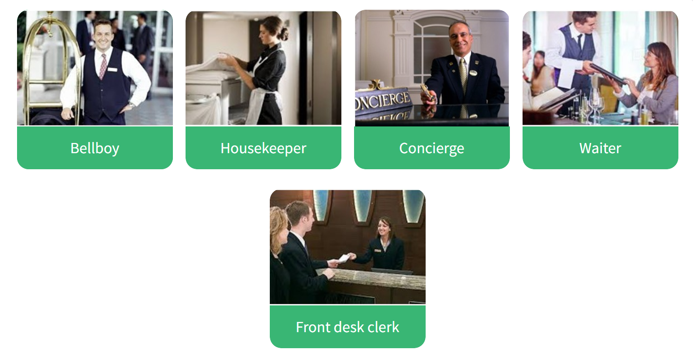

# 2.3.5 Solving unplanned problems

## Key words of the lesson

| Situation         | Solution              | Related expression                         |
| ----------------- | --------------------- | ------------------------------------------ |
| flight delayed    | refund / new flight   | I am sorry, but the flight....             |
| flight cancelled  | full-refund           | I am afraid the flight...                  |
| flight overbooked | next flight / upgrade | I am sorry sir. There are no more seats... |
| extra-luggage     | pay extra fee         | You can't...                               |

## Airports – What could go wrong?

Airports – what could go wrong?  
  
If you're planning on traveling by plane in the near future, then it's extremely important to pay attention to some possible problems you may encounter.  
  
* The most common ones: delays or cancellations. The first thing you need to know is your airline's policy - some airlines offer full-refunds, compensations, or tickets for the customer's next flight, but not all of them have these policies. So, you need to make sure they offer alternatives.  
  
* Another common problem is when the flight is overbooked. This happens when the airline sells more tickets than the aircraft's capacity or oversells tickets, or there is a last-minute change and the aircraft is smaller than the one you were supposed to travel on. Then, the airline asks for volunteers or selets passengers involuntarily to go on the next flight.  
  
* When you return from your trip, your luggage is heavier than permitted. You should avoid this by packing light or putting the heavy items in your hand luggage. However, if you are at the desk and find that this is the case, you can either throw some things away or pay the extra fee.  
  
**If you have ever had any of these experiences and you want to tell us about them, feel free to leave a comment on the "comments" section or email us.**

## Airports – What could go wrong? - Vocabulary

Read the previous article on airport problems and find the words in the text that match the following definitions.

* Delayed is... to be late or slow.
* A refund is... money paid back to a customer who is not satisfied with goods or services bought.
* A policy is... a course or principle of action adopted by an organization. Example: "refund..."
* An aircraft is... an airplane, helicopter, or other machine capable of flight.
* A fee is... money paid as part of a transaction.

## Airports – What could go wrong? - Comprehension

Read the article again and answer the following questions.

* Who is this article recommended to? People who *are planning* to travel by plane.
* What is the first thing you need to know in case of a delay or cancellation? You need to know the *company's policy*.
* Why may a flight be overbooked? Because the company *sold* more tickets than available seats or that the aircraft is *smaller* than the original one.
* What can you do if you want to share your experiences? You can leave *a comment* or send *an email*.

## Airport Problems

Look at the following problems you can find while you're planning your trip or flying. Match problem with solution.

- I'm sorry, but there are no more window seats available.
- Ok, I'll take an aisle seat.

- I'm afraid we don't accept Mastercard here. Ok,
- I'll give you my American Express card.

- I'm sorry, sir, but you can't take that water bottle with you.
- No problem. I'll throw it away.

- You can't fly with pets on this airline!
- I'll go to another airline then.

- I'm afraid the weight limit is 40 lbs and your bag weighs 45lbs. The extra fee is $100.
- I'll pay the extra fee. Here's my card.

## Hotel workers

Look at the hotel workers and match them with the corresponding picture.

## Hotel workers - Function

What do these people do? Match the beginnings and endings to describe what these hotel employees do.

* The bellboy… carries luggage.
* The housekeeper… cleans the rooms.
* The concierge… gives information.
* The waiter… serves food.
* The front desk clerk… registers guests

