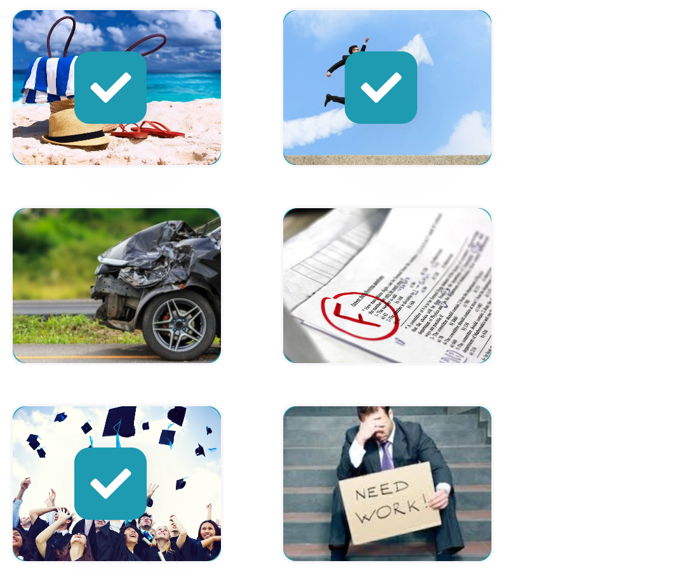
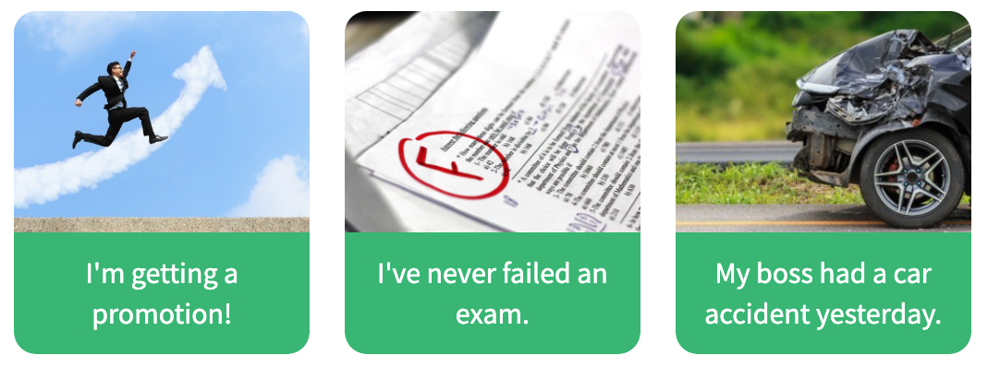
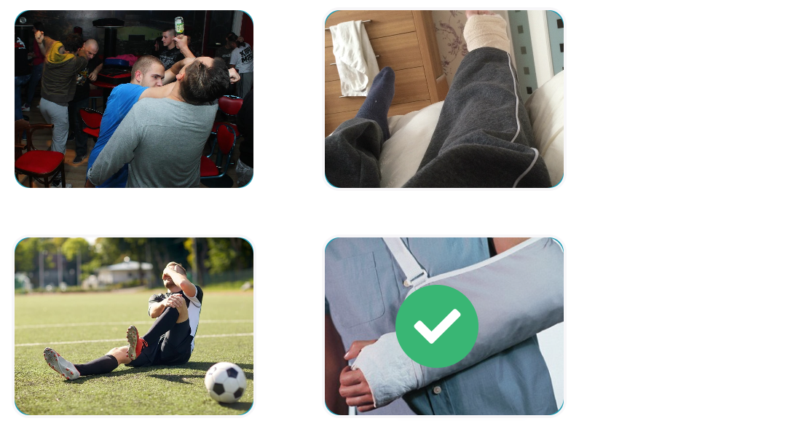
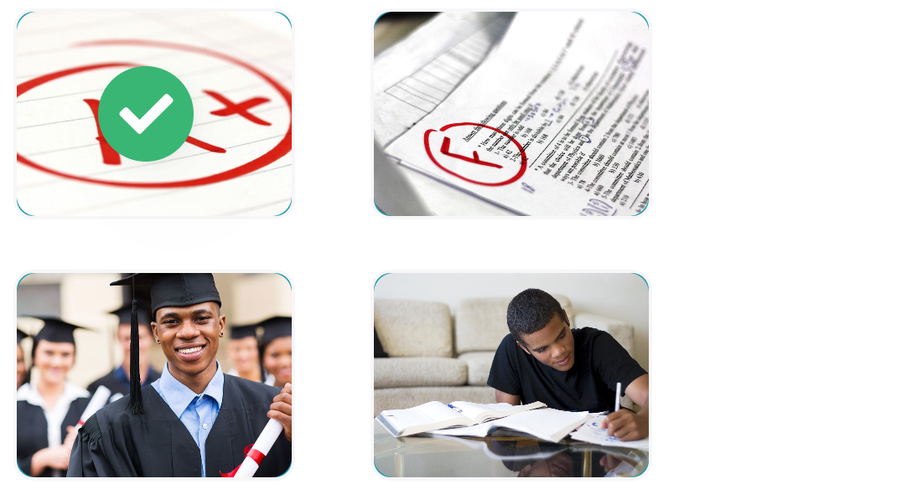

# 2.4.2 Describing experiences

## Keywords of the lesson

| Finished actions                               | Unfinished actions                   |
| ---------------------------------------------- | ------------------------------------ |
| I got my degree in 2008.                       | The company has been expanding.      |
| I worked for the same company for 20 years.    | I've worked here for 20 years.       |
| He had a very interesting job, but he lost it. | I've attended courses before.        |
| I've worked hard to finish the presentation.   | I've been working on this for weeks. |

## Life Experiences

We can talk about the things we have done/haven't done in our lives using **Present Perfect Tense:**  
  
* ***I've skydived** many times.  
* ***I've never eaten** Chinese food.  
* **Have** you **ever been** to Europe?  
* Yes, I **have!**

## Positive experiences?

## Ever or Never? (1/2)

When we want to ask people about their experiences, we must include ever, which means "In your entire life."  
  
Have you **ever** driven a Ferrari? = Have you driven a Ferrari **in your entire life**?  
  
* Yes, I have.  
* No, I haven't.

## Ever or Never? (2/2)

When we want to talk about things we haven't experienced (yet), we use **never**.  
  
I've **never** failed an exam.  
I've **never** been to Australia.

## Describing experiences (1/2)

Read the following experiences and match them with the corresponding picture.

## Describing experiences (2/2)

Read the following experiences and match them with the corresponding picture.

## Have you ever? Talking about experience (1/3)

Listen to the following conversation and check the corresponding picture.

## Have you ever? Talking about experience (2/3)

Listen to the following conversation and check the corresponding picture.

## Have you ever? Talking about experience (3/3)

Listen to the following conversation and check the corresponding picture.

## Describing experiences in general (1/4)

Put the following words in order to form sentences or questions about people's experiences.

I have never eaten sushi.

## Describing experiences in general (2/4)

Put the following words in order to form sentences or questions about people's experiences.

Have you ever learned to speak French?

## Describing experiences in general (3/4)

Put the following words in order to form sentences or questions about people's experiences.

Have you ever delivered a presentation?

## Describing experiences in general (4/4)

Put the following words in order to form sentences or questions about people's experiences.

I have never ridden a horse.

## Ever or never?

Complete the following questions and sentences with the correct option.

* Many people have  **never** been bullied by one of their co-workers.
* Have you  **ever** felt like you're not appreciated enough at work?
* Our CEO has **never** visited the plant. He has no idea who we are.
* Has your job **ever** made you feel stressed?
* Have you **ever** seen a person accepting a *bribe? If the answer is yes, then report it!

> Bribe = Something (usually money or valuable goods) given in exchange for influence or as an incentive for dishonesty.

## Written resume vs. Recorded resume

Listen to Dakota's audio resume. Check the topics that she mentions that are included in regular resumes.

* [x] First name
* [x] Last name
* [ ] Address
* [ ] Phone number
* [x] Work experience
* [x] Academic information
* [ ] References
* [x] Objective

## Describing professional experience

Listen and choose the correct option to complete the sentences.

* She **has** worked for PAC Automobiles for the past three years. 
* She has **managed** a team of ten marketing specialists. 
* She has **increased** the department's productivity by 27%. 
* She **was** the Marketing Manager for Marketing Solutions until 2015. 
* She **got** her bachelor's degree in 2010.
*  She **is** moving to the Cambridge area in September.

## Describing experience or events? (1/4)

Choose the correct explanation for the phrase: "I have worked for PAC Automobiles."

* [ ] She worked there, but she doesn't work anymore.
* [x] She started working in the past, and she still works there.

## Describing experience or events? (2/4)

Choose the correct explanation for the phrase: "So far this year, we have designed a new company website, and we have successfully launched a new range of luxury products."

* [x] List of activities done during the current year.
* [ ] List of activities done during the previous year.

## Describing experience or events? (3/4)

Choose the correct explanation for the phrase: "Before that, I was the Marketing Manager in a consulting agency, Marketing Solutions."
  
* [x] Previous job - she started and finished working in the past.
* [ ] Current job - she started in the past, but continues in the present.

## Describing experience or events? (4/4)

Choose the correct explanation for the phrase: "For personal reasons, I am moving to the Cambridge area in September."

* [ ] She has decided to move to Cambridge.
* [x] She has a definite plan to move to Cambridge.

Has it finished?

We can also use the **Present Perfect Tense:**
- When the action is not yet finished, but started in the past.  
  
**I've worked** in this company **for two years.** = I still work in the company.  
**She's studied** for her master's degree **since 2017.** = She's still studying for her Master's.

## Finished or unfinished action?

Read the following sentences and decide if the actions have finished or not.

* Our company has been expanding for a long time. **Unfinished action**
* I got my bachelor's degree in chemistry in 2008. **Finished action**
* Charles worked for the same company for twenty years. **Finished action**
* Jane has studied medicine since 2016. **Unfinished action**
* Tori had a very important job in an international company.  **Finished action**
* I sent you an email five minutes ago. **Finished action**
