# 2.4.4 Presenting information

## Key words of the lesson

| Graphic representations | Describing changes       | How can things change? |
| ----------------------- | ------------------------ | ---------------------- |
| graph                   | It has been expanding... | steeply                |
| pie chart               | The company has grown... | dramatically           |
| flow chart              | Sales have increased...  | slightly               |
| bar graph               | Claims have decreased... | sharply                |
| line graph              | Sales went up / down     | significantly          |

## Describing changes

When we want to talk about the changes a person, place, or company has experienced, we use the **Present Perfect Tense.**
  
- *This company **has expanded** exponentially in the last decade.*
- *I **have studied** French for the past year.*
- *The city **has grown** because of tourism.*

## Rising trend changes

These are examples of changes in a rising trend:  
  
- *The city has **grown** a lot.*
- *With the new training course, I've **improved** my communicative skills.*
- *The company's profits have **gone up** since we launched the new design.*
- *Salaries have **risen** since the last economic crisis.*

## Falling trend changes

These are examples of falling trend changes:  
  
- *Tourist visits have **declined** after the last hurricane.*
- *With my new therapy, my stress levels have **decreased**! I feel calmer now.*
- *The company's sales have **fallen** after the negative reviews on our new model.*
- *In the last decade, employment rates have **dropped**.*

## No change

These are examples you can use to say there were **no changes**:

- *The city population has **stayed the same** in the last year.*
- *The amount of raw material purchases have **remained constant** for the last two weeks.*
- *Sales have **leveled off** during the low season.*
- *Our profit margin has **stabilized** after the sales drop last month.*

## Vocabulary to describe graphs - Up, down, or stable

Look at the following sentences and match the corresponding graph.

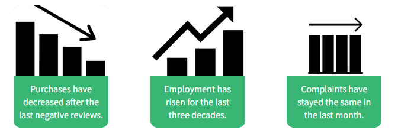

## Significant changes

These are examples you can use when changes are **significant or abrupt**:  
  
- *People **suddenly** stopped what they were doing after the car crash.*
- *Sales have dropped **sharply** since the last incident.*
- *Rent costs have risen **dramatically** in the last months.*
- *Sales have gone up **steeply** since our last TV commercial.*
- *The company has expanded **a lot** in the last six months.*

## Very slight changes

When there have been small changes, we say:  
  
- *Motivation among the staff has improved **slightly** since we brought the snacks vending machine.*
- *The stadium became **gradually** silent after the last goal.*
- *Our staff has increased **slightly**. We now have three more employees.*
- *Our sales have increased **slightly** since the last crisis.*

## Fluctuating changes

If you want to refer to fluctuating changes, you can say:  
  
- *Crime rates have **fluctuated** in the last three years.*
- *Productivity has **gone up and down** due to the number of staff absences in the last four months.*
- *Sales have been **unstable** for one year. It seems we can't stabilize them.*
- *Motivation rates have **fluctuated** for the past two weeks. We need a new strategy.*

## Vocabulary to describe graphs - Significant changes

Look at the following sentences and match the corresponding graph.

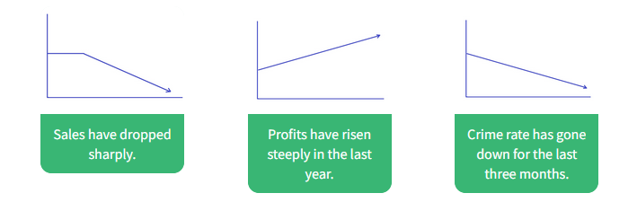

## Vocabulary to describe graphs - Ups and Downs

Look at the following sentences and match the corresponding graph.

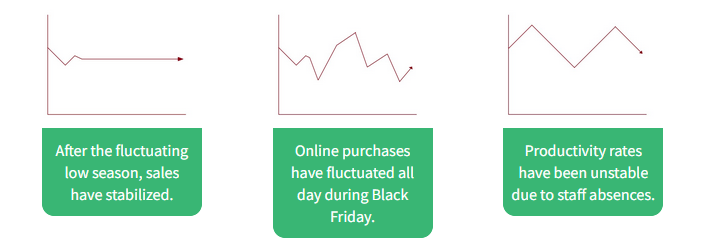

## Describing graphs (1/3)

Look at the following graph and choose the correct explanation.  

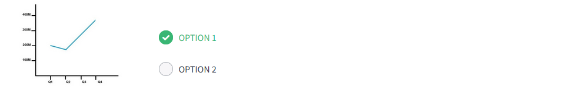
  
- [x] OPTION 1: Sales last year decreased slightly for one quarter. But then, they rose steeply for two quarters.  
- [ ] OPTION 2: Sales last year stayed the same for one quarter. But then, they dropped for two quarters.

## Describing graphs (2/3)

Look at the following graph and choose the correct explanation.  

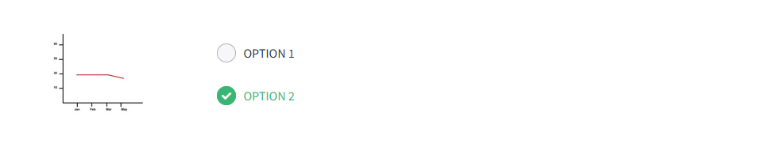
  
- [ ] OPTION 1: The number of complaints remained constant for three months, and then went up and down after the new quality control measures.
- [x] OPTION 2: The number of complaints stayed the same for three months, and then decreased slightly after the new quality control measures.

## Describing graphs (3/3)

Look at the following graph and choose the correct explanation.  

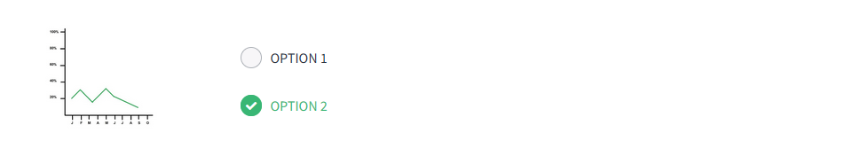
  
- [ ] OPTION 1: Crime rates were unstable for six months, but they have gone up slightly for three months.  
- [x] OPTION 2: Crime rates went up and down for six months, but they have gone down sharply for three months.

## Vocabulary - Graphic representation types

Match the following types of graphic representations with their names.

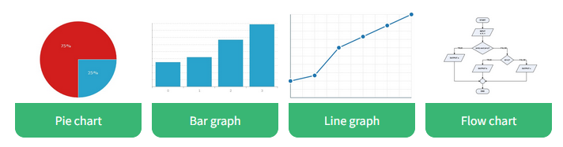

## How to describe a graph (1/3)

Listen to the following description of a graph. Choose the correct visual the person is explaining.

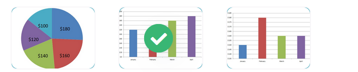

## How to describe a graph (2/3)

Listen to the following description of a graph. Choose the correct visual the person is explaining.

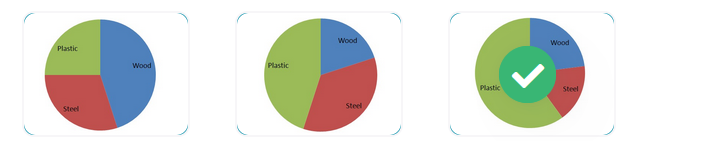

## How to describe a graph (3/3)

Listen to the following description of a graph. Choose the correct visual the person is explaining.

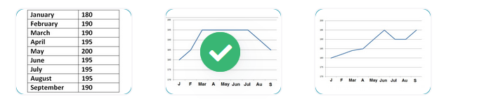

## Describing trends (1/3)

Read the words and put them in order.

Sales have fallen dramatically.

## Describing trends (2/3)

Read the words and put them in order.

Profits have increased since 2017.

## Describing trends (3/3)

Read the words and put them in order.

Death rates have been unstable for three years.

## Making a formal presentation - Introduce yourselves

Listen to a fragment of a presentation and choose the correct answer.

- Who is the woman? She's Sarah Jameson.
- What is her job? She's an analyst and works for an online business network.
- What is the presentation about? The presentation is about Facebook.
- What is Facebook, according to her? According to her, it is the most important online phenomenon and a success story.

## Making a formal presentation - Sequence and organize a presentation

Listen to the complete first part of the presentation again and match beginnings and endings to make up the phrases she uses to organize the presentation.

- Firstly, I'm going to tell you a bit about… the history of the company.
- Then, I'm going to talk… about the structure of the company.
- After that, I'll look at… the revenues and the connection with online ads.
- Finally, I'll talk about… the number of users the last ten years.

## Making a formal presentation - Describing a slide

Listen to the fourth part of Sarah's presentation and choose the correct option.

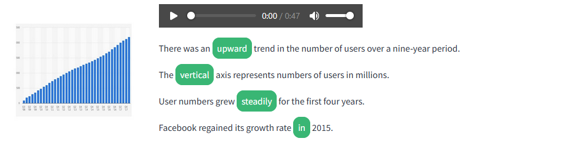

- There was an **upward** trend in the number of users over a nine-year period.
- The **vertical** axis represents numbers of users in millions.
- User numbers grew **steadily** for the first four years.
- Facebook regained its growth rate **in** 2015.
