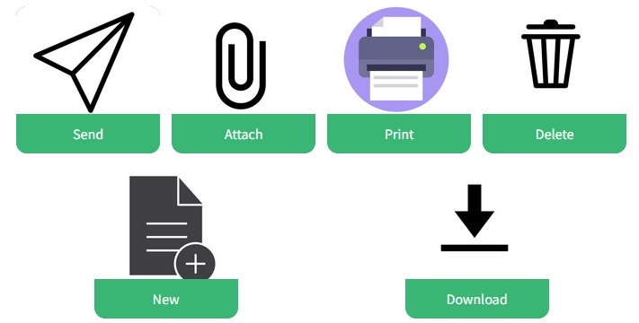
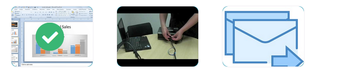

# 2.4.5 Reporting progress

## Key words of the lesson

| Verbs   | Time expressions | Examples                                      |
| ------- | ---------------- | --------------------------------------------- |
| print   | just             | She's just printed the report.                |
| send    | already          | I've already sent the comments.               |
| hand in | still            | She still hasn't handed in the final version. |
| prepare | yet              | They haven't discussed it yet.                |

## Computer vocabulary

Look at the following icons you can find on your computer. Match them with the corresponding written version.

## Describing activities at work

Match the beginnings and endings to describe activities we do at work.

* Hand in... **a report.**
* Send an... **email.**
* Attach... **a document.**
* Deliver... **a speech.**
* Attend... **a meeting.**
* Prepare a... **PowerPoint presentation.**

## Reporting Progress

When we talk about projects in progress, and we need to report the things that we have finished (or not) we can use:  
  
* We **have finished** the research stage.
* We **have just sent** the report to the Marketing Department.
* They **have already sent** us the ideas for the next campaign.
* She **still hasn't decided** which slogan to use.
* However, we **haven't started** with the design of the slogan **yet.**
* **Has** Jim **called** us with the new ideas **yet?**

## Just

We use **JUST** to include the idea that the action happened a **very short** time ago.  
  
* *I've **just** sent the email. = She pressed "send" less than one minute ago.*
* *I've **just** seen Tom. = She saw him at the entrance less than five minutes ago.*
* *She's **just** arrived. = She's entering the office.*

> We only use **just** for **positive** statements.

## Already

We use **already** when we talk about things we've finished before expected, by now, surprising soon, or early.  
  
* *We have **already** finished our design project! - The deadline was next week.*
* *I've **already** arrived at the office - It's 07:30 a.m. and you enter at 8:00.*
* *The fourteen-year old kid has **already** got his first bachelor's degree* - Usually, people get their degrees by the age of 20 or more.

## Still

We use **still** when something that was supposed to happen, has not happened.  
  
* *The IT department **still hasn't finished** repairing the servers! - The deadline was a week ago.*
* *We **still haven't found** an accountant for the new branch. - They were supposed to find one by now.*
* *She **still hasn't arrived** at the office. - She was supposed to arrive half an hour ago.*
  
> Remember: We use **still** in **negative** statements!

## Yet

We can use **yet** in two different ways.  
  
* *I haven't handed the report in **yet**. - You haven't done it, but you will do it in the near future.*
* *I'm really hungry. I haven't had breakfast **yet**. - You haven't had it, but you will.*

* *Have you signed the contract **yet**? - When you want to ask for something the other person was supposed to do.*
* *Has she contacted the lawyer **yet**? - You want to know if she did what she was supposed to do.*

> Remember: You can use **yet** in **negative** statements and **questions**.

## Reporting on work activities (1/5)

Read the following words and put them in order.

**I still haven't finished the report.**

## Reporting on work activities (2/5)

Read the following words and put them in order.

**The plane has not landed yet.**

## Reporting on work activities (3/5)

Read the following words and put them in order.

**Have you booked the hotel yet?**

## Reporting on work activities (4/5)

Read the following words and put them in order

**The meeting has already finished.**

## Reporting on work activities (5/5)

Read the following words and put them in order.

**My PA has just handed in the report.**

## Talking about activities using just, yet, already, or still

Read the following sentences and choose the correct option.

* I've **just** handed in my report. Just in time!
* Jeremy **still** hasn't called. I told him to call me an hour ago.
* The consulting agency has **already** recorded the TV commercial. They told us it would take one week to complete.
* Has Andrea arrived **yet**? We've been waiting for her presentation for ten minutes.
* My PA hasn't sent the email with the schedule **yet**. We can expect her email very soon.

## Changes in meaning - just/still/yet/already (1/4)

Choose the best explanation for: "I still haven't written the report."

- [x] The report is not ready, but it will be.
- [ ] The report is ready to be sent.

## Changes in meaning - just/still/yet/already (2/4)

Choose the best explanation for: "The IT department has just fixed the server."

- [ ] They haven't finished working on the servers.
- [x] They finished a short time ago.

## Changes in meaning - just/still/yet/already (3/4)

Choose the best explanation for: "The meeting has already finished."

- [ ] The meeting still hasn't finished.
- [x] The meeting was supposed to be longer, but it finished early.

## Changes in meaning - just/still/yet/already (4/4)

Choose the best explanation for: "Has Carla set up the website yet?"

- [x] The person asking expects Carla to have done it or do it soon.
- [ ] The person asking thinks she has already finished.

## Talking about finished activities (1/3)

Listen to the conversation. Check the activities that are ready.

## Talking about finished activities (2/3)

Listen to the conversation. Check the activities that are ready.

## Talking about finished activities (3/3)

Listen to the conversation. Check the activities that are ready.

## Reporting progress of a project - finished vs unfinished activities

Listen to the conversation between Sandra and her boss. Check the activities which are already FINISHED.

- [x] Shortlist the candidates
- [x] Read the resumes (Sandra)
- [ ] Read the resumes (Francis)
- [ ] First interviews
- [ ] Final interviews
- [ ] Meeting with PAC's CEO
- [x] Detailed job description

## Asking about progress of a project

Read the following phrases and listen to the conversation again. Match beginnings and endings.

* Where are we... **with recruitment exactly?**
* Have you... **checked your emails?**
* And what about... **the final interviews?**
* Have you written... **the detailed job description yet?**

