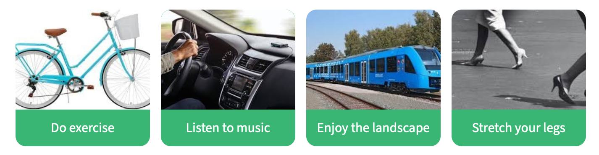
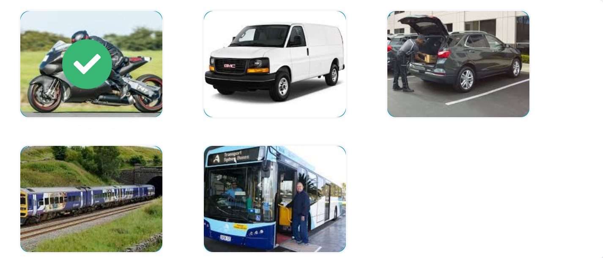
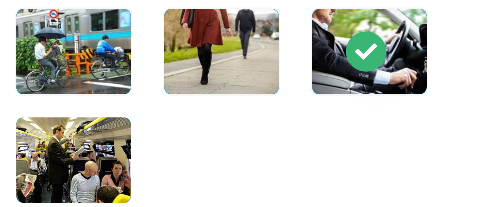

# U1.3 Commuting

In this lesson, you will learn about different ways of commuting to work . You will read and listen to different people telling how they travel to work.

# Key words of the lesson

| Benefits                 | Drawbacks                 |
| ------------------------ | ------------------------- |
| exercise                 | less time with family     |
| time for personal growth | feeling uncomfortable     |
| planning ahead           | wasting time              |
| listening to music       | driving during rush hours |

## Benefits and drawbacks

**Choose the benefits of commuting to work.**

- ✔️ It's a good opportunity to do exercise.
- ✔️ You can make time for personal growth.
- ❌ You spend less time with your family and friends.
- ❌ You can feel uncomfortable.
- ✔️ You can plan your day ahead.

What do you do when...?

Look at the pictures and match the phrases to say what people do when commuting.

## Transportation

**We can take different means of transport to get to work. Look at the list:**

- Airplane / Plane  
- Bicycle / Bike  
- Boat  
- Bus  
- Car  
- Bike (Motorcycle / Motorbike)  
- Subway / Metro (US) Underground / Tube (UK)  
- Taxi  
- Train / Metro / Subway  
- Tram (UK) / Streetcar / Trolley (US)  
- Truck  
- Van

## How do you get to work? (1/2)

**Read the following text and pay attention to the information provided. You will need it in the next activity.**

Going to work was not enjoyable to me. I work in the city center for a logistics company. I'm a driver there, so I have to deal with traffic all the time. Cars, horns, buses - hey all really drive me crazy. Previously, commuting to the city center was not easy either. I used ==public transportation==, like the ==bus== or ==train==, to get to my job. I was delayed all the time. Now, my life has changed since I bought it. Feeling the air in my face and avoiding all the traffic jams on the highway is the best thing that has happened to me.

## Different ways to go to work

Listen to the people and match their names to the pictures.

## Daily commute (1/2)

**Read the following text and pay attention to the information provided.**

From Monday to Friday, I usually take the bus to get to work. The bus stop is five minutes from home, and it doesn't take me long to get to work. My wife, however, drives to work. Her office is in the city center, and she has an hour journey before arriving at the office. She always complains because she's usually in traffic jams. I don't enjoy driving, and that's why I take the bus. I generally read a book, or I just look out the window. It's my peaceful moment of the day. Patients can drive you crazy sometimes.

## Daily commute (2/2)

**Match the questions to the answers.**

- How does the man's wife arrive to work? **She goes to work by car. **
- Does she like it? **No, she doesn't.**
- Does the man have a better time commuting to work? **Yes, he does.**
- What does the man do? **He's a doctor.**

## Train travel

**Choose the correct option in each sentence.**

During rush hour, there are so many people on the train that all of the seats are taken, so it's **standing room only** if you want to ride.

The conductor just made **an announcement** that the train would be delayed for about 15 minutes due to an accident.

These seats are reserved for senior citizens and the physically impaired, so you might have to **give up** your seat if needed.

## Packed like sardines

**Read the text and choose the correct option.**

I **leave** for work about 6:30 a.m., and I walk to a bus stop not too far from my house. I catch a **bus** that comes by around 6:45. The bus isn't very crowded when I get **on**, but it fills up before reaching the terminal. Then, I get off the bus and catch a train going into town. The train ride takes about 30 minutes, and it's usually standing-room only.

People are packed like sardines on the train. There's a train stop about two blocks from my office. The entire trip **takes** about an hour. I buy a monthly bus pass, and I **save** a lot of money by using public transportation instead of driving my own car.

## Commuting

**Put the words in order to form questions.**

What do you usually do  while commuting?

Does it take you long to get to work?

Do you  ever chat with other travelers on the train?
(Do you ever chat whit the other travelers on train?) ==???==

Is she driving to work today?

## How do I get to work?

Listen and choose the correct picture.

> Thank god I have a car!

## Are you commuting to work? (1/2)

**Match the ideas to make sentences.**

- Trains in my city are always crowded. **Many people take them to go to work.**
- She never drives to work – she walks. **Her office is near her house.**
- It is difficult to find a place to park the car if you go to the office by car. **There are many cars in the city these days.**

## Are you commuting to work? (2/2)

**Match the ideas to make sentences.**

- I find cycling a healthier way to go to the office. **You can do exercise while you're going to work.**
- I usually take the bus to get to the office. **If I have a seat, I always read a book.**

## Trip in the summer

**Put the sentences in order.**

This summer, I'm planning on taking a trip to Europe, 
and I want to be able to get around easily, 
so I'm looking into buying a cheap train pass or tickets to make travel a little easier. 

Train fares often drop in price depending on the season, 
so if I end up traveling during the off season (not a time when most people are vacationing), 
I might be able to get a better deal on a train pass.

## Traveling by train (1/2)

**Read the following text and pay attention to the information provided.**

After I leave home, I walk to the station to catch the train. This is the easiest way to get to my office. At the station, I buy a ticket from the ticket machine and then wait on the platform for the train to come. The train is scheduled to arrive at the station at a quarter to seven, and it is usually on time, although it is sometimes delayed due to bad weather or accidents. When the train pulls into the station, people often crowd around the doors with the hope of rushing into the train to get a good seat. When my train arrives at my destination, I get off the train and exit the station. The entire trip takes about an hour.

## Traveling by train (2/2)

Put the events in order according to the text.

- leave home
- walk to the station
- buy a ticket from the ticket machine
- wait on the platform
- train arrives at 6.45 am
- people crowd around the doors
- get off the train
