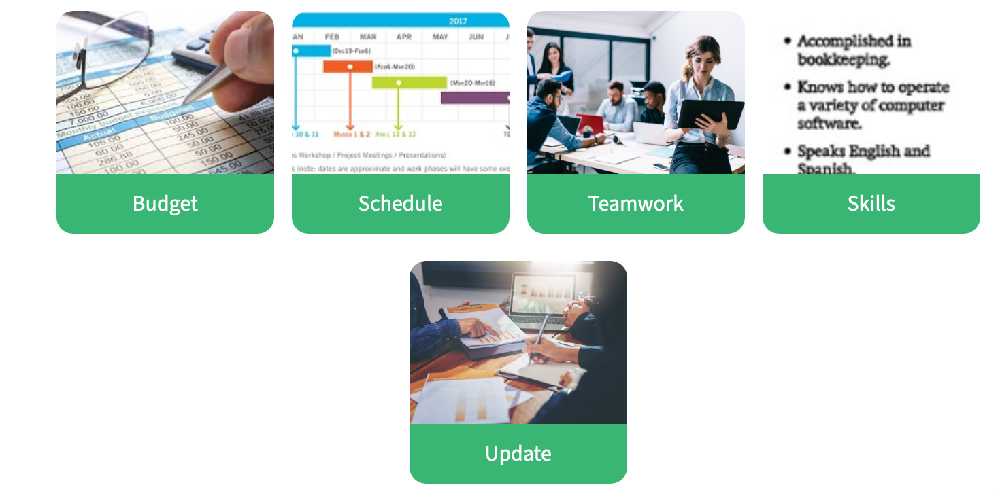

# U1.4 Managing projects

## Key words of the lesson

|Steps|Actions|Expressions|
|---|---|---|
|kick-off meeting|delegate tasks|Could you please...?|
|action plan|find common ground|We're just waiting for the desks|
|schedule|be back to track|Everything's back on track.|
|deadline|allocate resources|Let's allocate tasks.|
|budget|give an update|I'm just calling for an update on the center.|
|resources|work on teams|Well, I'll let you get back to work.|

## Leader or team player?

Do you prefer to lead a project or just be part of the project team?

When you think of projects, you might think of something quite complicated and extensive, like a new office project.

But in fact, most of the tasks we do in business are part of a project.

Even something as simple as writing a proposal is a project in itself: First you collect data, then you analyze and evaluate the data before writing a draft.

Finally, you edit the draft and present a final version.

Knowing how to refer to different elements of a project and describe them with interesting collocations is important for everyone involved in business today.

## Project in progress

**Read what Samantha tells Julie about a project they're working on in a youth center.**

- **Samantha:** Hello, Samantha speaking.
- **Julie:** Hi Samantha. It's Julie. How are you?
- **S:** Oh, hi, Julie. I'm fine thanks. What can I do for you?  
- **J:** I'm just calling for an update on the center. How are things going over there?  
- **S:** Well, so far, so good. Everything's back on track.  
- **J:** Great. So what's happening with the decorating?  
- **S:** We're still painting the ceiling - it'll take another day or so.  
- **J:** OK. And where are we with the lighting?  
- **S:** We've finished that – it looks great.  
- **J:** Good – that was fast.  
- **S:** Yes, but we're still waiting for the desks.  
- **J:** Oh. OK, I'll call the suppliers and find out where they are. So, to recap, the painting's nearly done, the lighting's finished, and we're just waiting for the desks?  
- **S:** That's right.  
- **J:** Great. So it's all going according to plan. Listen, I'm coming over to the center tomorrow. How about we get the team together to allocate tasks for the final stages? And I'll give you an update on the carpets then.  
- **S:** Sure. No problem.  
- **J:** Good. Well, I'll let you get back to work. See you tomorrow.  
- **S:** Yes, see you tomorrow. Nice talking to you. Bye.  
- **J:** Bye.

## Project in progress - Useful phrases 1

**Let's analyse what Samantha has just said.**

Everything's ==back on track==. = Everything goes as planned.

How about we get the team together to ==allocate tasks== for the final stages. = We'll tell the rest of the team what their responsibilities will be.

I'll ==give== you ==an update== on the carpets then. = I'll tell you how things are going - show the possible progress of things.

## Project in progress - Useful phrases 2

**During their phone conversation, Julie asked Samantha about progress on the project they are working on.**

Study the following examples:

- *We' re still painting the ceiling.*
- *We' re still waiting for the desks.*

To show progress on projects Samantha used the **Present Continuous Tense.**

Note that we can also use the word still before the verb to show the activity is going on.

*We're still waiting for the desks.* = ==The carpets haven't arrived yet.==

## Phrases to refer to projects (1/2)

**Match the words to form phrases related to projects.**

- **Out**... of time
- **Over**... budget
- **On**... schedule
- **Ahead**... of schedule

## Phrases to refer to projects (2/2)

Match the words to form phrases related to projects.

- **On**... time
- **Within**... budget
- **Behind**... schedule

## Project vocabulary (1/2)

Match the words to the definitions.

- **Teamwork**... the act of working together.
- **Deadline**... a time or date by which you have to complete something.
- **Delegate**... assign work to someone else.

## Project vocabulary (2/2)

**Match the words to the definitions.**

- **Breakdown**... detailed information separated into different groups.
- **Allocate**... decide to use certain resources for a particular purpose.

## Giving updates on projects

**Choose the correct option to complete the sentences.**

- We have fallen **behind** schedule and the project will be late.
- They lost a lot of time, so they worked on the weekends to catch **up**.
- Everything is on schedule. The work is on **track**.
- There isn't a lot of money, so we have to **allocate** our resources carefully.
- This project is very expensive, and it will be difficult to **stay** within budget.

## Project management

**Choose the correct word to complete the sentences. There are three extra (invalid) options.**

- We have a **teamwork** problem because people are not communicating.
- There is not enough money in the **budget** to complete the project.
- There are three weeks in the **schedule** to recruit the staff.
- We don't have anyone with IT **skills**, - we need a computer specialist.
- We have a project **update** meeting every week to discuss its progress.

## Updates on a project (1/2)

**Read the following email.**

**To:** Louise Bernard  
**From:** Steve Lenzer  
**Subject:** Update from Brazil  
**Date:** 22 May, 2019  
  
Hi Louise,   
  
We're very lucky to have this construction contract in Brazil. It's a pity that I'm only here for a week, but that's the business. Anyway, let me update you on my visit here.
  
The construction of the Belem Panorama is going well, and guests will love it! Apart from some minor problems, everything is proceeding according to plan. They're now building the swimming pool on the 12th floor. The local staff is working very well with our management team.
  
I'm working in Fortaleza today and tomorrow. The new shopping center is quickly taking shape: there are no problems, and I think we're ahead of schedule. They're doing a great job here too.
  
I'm flying back to the US on the weekend, so I'll see you in the office on Monday.

Best wishes,   
Steve

## Updates on a project (2/2)

After reading the email, choose the sentences that are correct.

- ✔️ Steve is in Brazil for work.
- ✔️ The Belem Panorama is a hotel.
- ❌ There was a problem with the floors of the Belem Panorama.
- ❌ The construction of the shopping center is behind schedule.
- ❌ Steve is staying in Brazil until Monday.

## Writing an email

**Choose the correct word to complete the email.**

Hi Louise, 

Just to update you on the project here in Valencia. We **are having** some problems, I'm afraid. The local manager **isn't following** the building plans and everything is behind schedule. I **'m meeting** with the subcontractors this afternoon. I need to know why everything **'s taking** so long. I hope to get some answers! I **'m flying** to London on Tuesday evening. I'll see you on Wednesday.

Best regards,
Carlos

## Past activities

When we work with projects, we usually refer to things that happened before. We use the Past Simple Tense to do that.

Remember that we use this tense to talk about **completed actions.**
  
- *We ==finished== the project ten days ago.*
- *We ==had== some problems at the beginning of the project.*

When referring to the past, we need to distinguish between **regular** and **irregular** verbs.

Regular verbs add ==-d== or ==-ed== to the verb in positive sentences.

Some verbs are irregular, and their past form changes slightly from the infinitive form. To know what the past form is, we need to use a list of irregular verbs.

For negatives and questions (both regular and irregular verbs) we need to use the auxiliary **did**.

- We ==didn't check== the figures of the project's budget.
- ==Did== you ==make== any changes to your last project?

Note that when we use the auxiliary, we use the verbs in the infinitive and not in the past form.

- ❌ **Wrong:** ~~==Did== you ==hired== a new contractor? No, I ==didn't hired== anyone new.~~
- ✔️ **Right:** ==Did== you ==hire== a new contractor? No, I ==didn't hire== anyone new.

## Referring to past activities in projects

Choose the correct sentences.

- ❌ We didn't finished the project on time.
- ✔️ One of our suppliers complained about our services.
- ✔️ The team didn't meet the deadlines and failed.
- ❌ Did we went abroad last month?
- ✔️ Did she visit new customers last Monday?
- ❌ The company goed bankrupt after the Great Depression

## Project in progress - Stages

**Sasha, Bruno, and Josie are working at the youth center. Jamie visits the team to see how things are coming along with the project.**
  
Listen to the conversation and pay attention to the information given.

There are different stages when we report the progress of a project. These are some of the stages the audio presented:  
  
- Allocate tasks  
- Agree to do the task  
- Offer to do something  
- Decline to do the task  
- Summarize

## Decisions and plans

When we work with projects, we sometimes need to make decisions or plans. To do that, we need to use the **future tense.**

Look at the following examples:

- **A:** I cannot finish this report on time.
- **B:** Don't worry. ==I'll help== you.

- We use ==will== and a verb in the **infinitive** to make an instant or spontaneous decision to do something.
- We can also use ==to be going== to when we want to talk about something we intend to do or we have already decided to do.
- 
==I'm going to accept== the job as project manager.

Remember that we use **am/is/are going to** and a verb in the **infinitive** form to make this type of sentence.

## Making decisions and plans (1/2)

**Look at the sentences and choose the ones that refer to spontaneous decisions .**

- ✔️ There are no flights to Paris. I'll take Eurostar then.
- ✔️ Mr. Jones is busy at the moment. I'll call him later.
- ❌ We're not going to travel abroad this year.
- ❌ They're going to buy new equipment for the project.
- ✔️ She'll take a look at the project plans later.
- ❌ He's going to make some staff changes.

## Making decisions and plans (2/2)

**Look at the sentences and choose the ones that refer to plans or intentions .**

- ❌ There are no flights to Paris. I'll take Eurostar then.
- ❌ Mr. Jones is busy at the moment. I'll call him later.
- ✔️ We're not going to travel abroad this year.
- ✔️ They're going to buy new equipment for the project.
- ❌ She'll take a look at the project plans later. 
- ✔️ He's going to make some staff changes.

