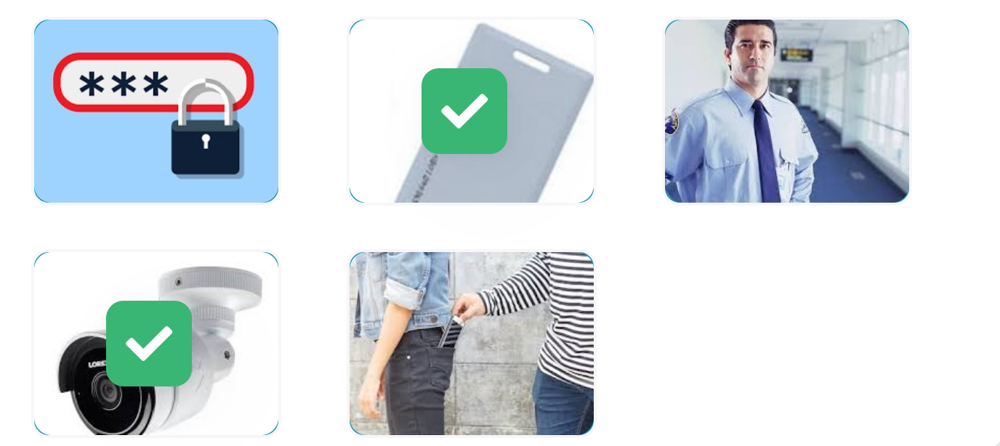

# U2.1 Safety and security at work

## Key words of the lesson

| Safety                   | Dangers             |
| ------------------------ | ------------------- |
| security                 | threat              |
| measures                 | breaches            |
| passwords                | unauthorized access |
| security pass            | identity theft      |
| security cameras / staff | stealing            |

## Safety and security at work

**Look at the quotation below.**

> *'At the end of the day, the goals are simple: safety and security.'*
> **Jodi Rell**
  
Do you work in a safe place? How important is safety and security at your work?  
  
How do you protect your information? Why is security an important issue for companies?

## Cloud-based Apps.

**Choose the cloud-based applications from the list. There is only one desktop application.**

- ✔️ Office 365
- ✔️ Microsoft's Office suite
- ✔️ G Suite
- ✔️ Dropbox
- ❌ Adobe Photoshop
- ✔️ Adobe Creative Cloud

## Is that app you're using for work a security threat? (1/3)

**Read the following article. You will need the information in the upcoming sections.**

Cloud-based apps often gain access to the camera, location, data, and contacts on your phone. So you never know how much sensitive company information they may be sharing. We could be giving hackers, fraudsters, and spies the keys to our company's back door, particularly if we use the same log-in details for external apps as we do for internal work apps.
  
Data leakage is a big problem. While apps such as WhatsApp and Dropbox, can help us do our jobs more efficiently - in the office and away from it - we often don't know if they've been approved by our IT departments or how much corporate data we may be sharing with the cloud. The worry for IT departments is that these third-party apps may not have particularly robust security protocols in place because many were developed primarily with consumers in mind.
  
On the other hand, many apps are also burdened with malware - another threat to corporate security. Most mobile apps are being monetized by selling users' information and phishing for banking credentials. Many organizations have lost money via these phishing apps - which often pretend to be something else, such as a Flash Player or even a Bible app - when they've allowed people in their finance departments to access corporate bank accounts via mobile devices. If a company doesn't know what apps their staff are using or what data is being shared, it poses a problem when those staff leave for other companies. All that data goes with them, possibly to your competitors. Web-based email programs can be just as risky.
 
- ❌ your wallet
- ✔️ your camera
- ✔️your location
- ✔️ your files
- ✔️ your contacts
- ❌ a VIP launge
- ❌ your desk at the office

## Is that app you're using for work a security threat? (3/3)

**Are these statements true or false? Choose the correct option.**

- ✔️ Cloud-based apps often gain access to the camera, location, data, and contacts on your phone. 
- ❌ We usually choose different passwords for external and internal work apps. 
- ❌ Apps such as WhatsApp and Dropbox, are always approved by our IT departments. 
- ❌ Malware is another solution to corporate security. 
- ✔️ A company's sharing banking information with its staff may lead to a serious problem when those staff leave for other companies.

## Talking about security breaches

**Look at the following examples of the most common security breaches.**

- Unauthorized access  
- Identity theft  
- Stealing  
- Entering a system without a password

## Talking about security measures

**Look at the following security measures.**

Passwords  
Security pass  
Security cameras  
Security staff

## Is it a safe place?

**Listen and choose the correct pictures. There are two correct options.**

## Burglar at the office

**Read and complete the text with the words.**

**Burglar doing ‘overtime'**

Police arrested a man last week for ==stealing== from his company's warehouse. Over a period of three months, the employee used his own ==security pass== to open up the warehouse in the middle of the night and load a van in full view of ==security cameras==.

The boxes contained DVDs and CDs. When police questioned ==security staff== who were paid to ==monitor== for such activity, they said, ‘We thought he was just doing overtime'.

A member of staff finally reported the man when he saw him selling DVDs in a street market on a Saturday afternoon.

The company has decided to review its ==security procedures==.

## Breaches and measures

**Listen and choose the phrases that you hear.**
 
- ✔️ Security pass
- ❌ Security staff
- ✔️ Password
- ❌ Security cameras
- ✔️ Monitor
- ❌ Identity theft
- ✔️ Unauthorized access
- ❌ Entering a system without passwords
- ✔️ Stealing

## Security measures

**Choose the phrases that are security measures.**
 
- ✔️ Security pass
- ❌ Entering a system without passwords
- ✔️ Security cameras
- ✔️ Monitor
- ❌ Identity theft
- ✔️ Password
- ❌ Unauthorized access
- ❌ Stealing
- ✔️ Security staff

## Security breaches

**Choose the phrases that are security breaches.**

- ❌ Security pass
- ✔️ Entering a system without passwords
- ❌ Security cameras
- ❌ Monitor
- ✔️ Identity theft
- ❌ Password
- ✔️ Unauthorized access
- ✔️ Stealing
- ❌ Security staff

## What are they for?

**Match the security measures to the correct sentence.**

- **Pin numbers:** They protect sensitive data. It includes only numbers.
- **Password:** It allows users to gain access to a device, app, or website.
- **Burglar alarm:** It is an electric device that rings a bell if someone tries to enter a building by force.
- **X-Ray machine:** It helps to find security threats hidden in suitcases and cargo.

## Security definitions (1/2)

**Match the words to the definitions.**

- **PIN number:** A secret code used to gain access.
- **CCTV:** A system that allows you to watch what is happening in other parts of the building.
- **Security measures:** Actions taken to deter people like hackers or thieves.
- **Identity theft:** Stealing people's personal information and using it.

## Security definitions (2/2)

**Match the words to the definitions.**

- **X-ray machine:** It allows you to see inside bags.
- **Unauthorized access:** Without the permission to look at or use something.
- **Antivirus software:** It protects your computer from attacks via email or the Internet.
- **Security breach:** When something is no longer secure.

## Thief in the workplace

**Read and complete the conversation with the words given. There are two extra options you don't need to use.**

- **A:** So, we had a security ==breach== last week. A thief broke into the office.
- **B:** Was the thief recorded by the security ==cameras==?
- **A:** No, because he hid his face.
- **B:** But we have security ==staff== working here. Why didn't they stop him?
- **A:** Because the thief had a security ==pass== and he showed it to them.
- **B:** Where did he get the card? Was it stolen?
- **A:** As part of our security procedures, the guards should check the photo.
- **B:** But didn't they check the photo this time?
- **A:** No, and so I think we need to introduce new security ==measures== to protect the company.

## Security problems

**Choose the correct alternative in each sentence.**

- It's advisable to insure all products ==against== theft.
- We use passwords to ==stop== people logging in.
- The CEO was prevented ==from== making further changes in the security procedures.
- To protect data ==against== viruses, it is advisable you use an antivirus.
- Those machines are used to scan ==for== illegal goods.
- CCTV can ==deter== burglars from continuing stealing in the neighborhood.
- The staff will monitor ==for== their safety.

## Security news

**Read the text and choose the correct option.**

**Security fears stop network administrators ==from== sleeping**

A new survey shows that many of the people who look after our networks can't sleep at night. Around 35% of network administrators say that monitoring the network ==for== security breaches and preventing hackers ==from== entering the system are major concerns. Another 24% lose sleep over how to safeguard ==against== the latest virus.

Many network administrators said they had little or no budget for training users in proper security practices on the computer.

This might include learning ways to protect ==against== hacking or checking ==for== malicious programs.

