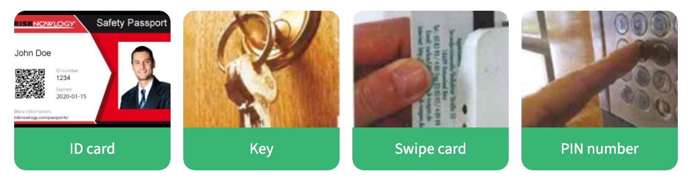

# U2.2 Security in the workplace

In this lesson, you will learn how to refer to security breaches, measures, and how to avoid them and define different types of security measures.

## Key words of the lesson

| Security breaches          | Security measures   |
| -------------------------- | ------------------- |
| unauthorized access        | safeguard databases |
| identity theft             | use of passwords    |
| personal information theft | data protection     |
| to steal information       | PIN number          |
| to break into              | to prevent          |

## Security breaches (1/2)

**Read the following text. Pay attention to the information provided.**

**Credit agency reports security breach**
  
More than 1,400 Canadians have been notified of a major security breach at Equifax Canada Inc., a national consumer-credit reporting agency. According to reports, unauthorized access was gained to the personal, detailed credit files which contained social insurance numbers, bank accounts numbers, home addresses, and job descriptions. With identity theft in Canada rising in one year from 8,100 to 13,000 reported cases, the industry is once again asking how to safeguard databases against identity theft, and deter people from entering the system without passwords.  
  
**Glossary**

- **Thief:** someone who steals something.  
- **Theft:** the crime of stealing.  
- **Steal:** to take something that belongs to someone else without permission (steal from / steal something from someone-something).

## Security breaches (2/2)

**Match the questions to the answers.**

- What was the security breach? **It was theft of information from databases as a result of unauthorized access.**
- What was stolen? **Personal information.**
- Who were the victims? **A credit agency and its customers.**

## Security

**Put the words in order to form sentences.**

- There's been a security breach at the bank.
- You need a security code to gain access to the system.
- How can we deter people from trying to break into our system?
- To prevent identity theft, be very careful with personal information.
- We are introducing identity cards as a security measure.

## Safety

**Match the words to the pictures.**

## Data protection

- You can ==insure== your card ==against== loss for as little as €1 per month.
- To ==prevent== anyone else ==from== getting your card by mistake, all cards are sent by certified mail.
- ==Check== the envelope ==for== any signs that it might have been opened before you accept the delivery.
- To ==deter== anyone else ==from== using your card, make sure you sign it immediately.
- To ==protect== data against fraud, never write your PIN (Personal Identification Number) down - keep it in your head.
- Make sure you ==scan== your monthly bank statement for any unauthorized use of your card.

## Safety and security (1/2)

**Match the sentences halves.**

- We have software **to protect against spyware.**
- We're scanning **these files to see if one has a virus.**
- Do you think the cameras **will deter people from stealing things?**

## Safety and security (2/2)

**Match the sentences halves.**

- Do we have security measures **to stop someone from entering our system illegally?**
- We use PIN numbers **to safeguard the system against unauthorized access.**

## Security upgrade

**Put the email in order**

To: All staff
Subject: Security upgrade

Dear All,

As you are aware, we have recently had a number of security breaches in our offices.

This has meant that we have had to introduce a series of new security measures.

These measures urged us to create a diagram to show how to use the new security pass system.

It also includes a map displaying all the new security equipment on site.

If you have any questions, please don't hesitate to contact us at security on extension +3546.

Anny Li
Head of Security

## Security measures: Advantages

**Match the security measures to their benefits.**

- ID CARD Easy to check by photo.
- PIN NUMBER More secure than free access.

## Security measures: Disadvantages

**Match the security measures to its disadvantages.**

- ID CARD Easy to lose.
- PIN NUMBER Someone might steal it by watching.

## New security measures in the workplace (1/2)

**Read the following conversation. Pay attention to the information provided.**

- **A:** So, as a result, we've been installing these electronic boxes on all the entrances around the building over the last few weeks. These are for a new swipe card system that will come into operation at the end of the month.  
- **B:** Sorry, but what's the reason for changing the current system? How long has Security been having a problem with the badge system?  
- **A:** For quite a while, I'm afraid. We've had three incidents reported since the beginning of the month. It's because security can't always check everyone's badge when they come in. By swiping these cards through these electronic readers on every door, we can check a person's identity anywhere in the building.  
- **C:** Sorry, but I don't quite understand how they work. Can you tell us more about them?  
- **A:** Mm. When you come to a door, you just swipe the card through this box at the side, and it opens.  
- **B:** Do you mean that we have to swipe every time we want to go through a door?  
- **A:** I'm afraid so, but the current situation, as it stands, simply doesn't prevent people from entering your office. By checking for identity at all the main doors, we hope to solve the problem, or at least make it safer.

## New security measures in the workplace (2/2)

**Match the questions to the answers.**

- What is the current security system? **It's a badge system.**
- What's the new system? **Swipe cards.**
